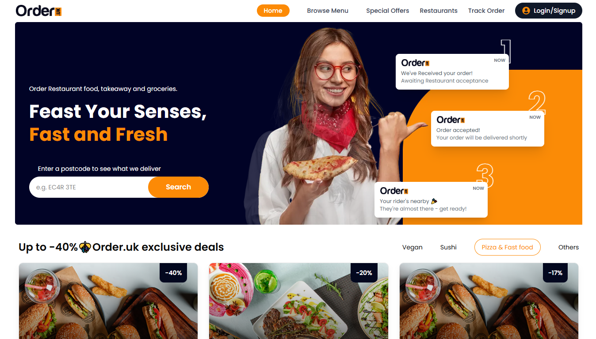

<!-- Hero Image -->

  

<h1 align="center">OrderUK</h1>

 A web-based food ordering and delivery interface where users can browse menus, search local restaurants, place orders, and track delivery status built with <strong>Next</strong> and <strong>TailwindCSS</strong>.

  🔗 <a href="https://foodie-jet-pi.vercel.app/" target="_blank"><strong>Live Demo</strong></a>

---

## 🚀 Overview

This is a web-based food ordering and delivery application that allows users to browse restaurants, explore menus, and search for dishes with pricing details. Users can add items to a cart, manage orders, and complete checkout through a simple and user-friendly interface. The application features a modern UI, smooth navigation, and core food ordering functionalities for real-world use.

---

## 🛠 Tech Stack

  
  
  

---

## ✨ Features

- 🍽 Browse restaurants and explore detailed food menus
- 🔍 Search for dishes with pricing and descriptions
- 🛒 Add items to cart and manage orders easily
- 💳 Simple and smooth checkout process
- 📱 Fully responsive and mobile-friendly design
- ⚡ Fast performance with a clean, modern UI

## 🔍 Preview

<!-- 
*Scroll-based animation and MacBook showcase section* -->

## 📦 Getting Started

### 1. Clone the Repository
git clone https://github.com/gideonabe/foodie
cd foodie

### 2. To install Dependencies
npm install

### 3. Start development server
npm run dev

### 4. Build for Production
npm run build

## 🌐 Live Demo

🚀 **[View the Live Site](https://foodie-jet-pi.vercel.app/)**  
> Best experienced on desktop with modern browsers

## 🙏 Credits

- Based on design UI from Figma

## 📄 License

This project is licensed under the **MIT License**

## 🤝 Let's Connect

If you liked this project, feel free to connect or collaborate:

- 🌐 Portfolio: [https://gideonabe.netlify.app/](#)
- 💼 LinkedIn: [linkedin.com/in/gideonabe](#)
- 🐦 Twitter/X: [@gideon_abe](#)

## Deploy on Vercel

The easiest way to deploy your Next.js app is to use the [Vercel Platform](https://vercel.com/new?utm_medium=default-template&filter=next.js&utm_source=create-next-app&utm_campaign=create-next-app-readme) from the creators of Next.js.

Check out our [Next.js deployment documentation](https://nextjs.org/docs/app/building-your-application/deploying) for more details.
